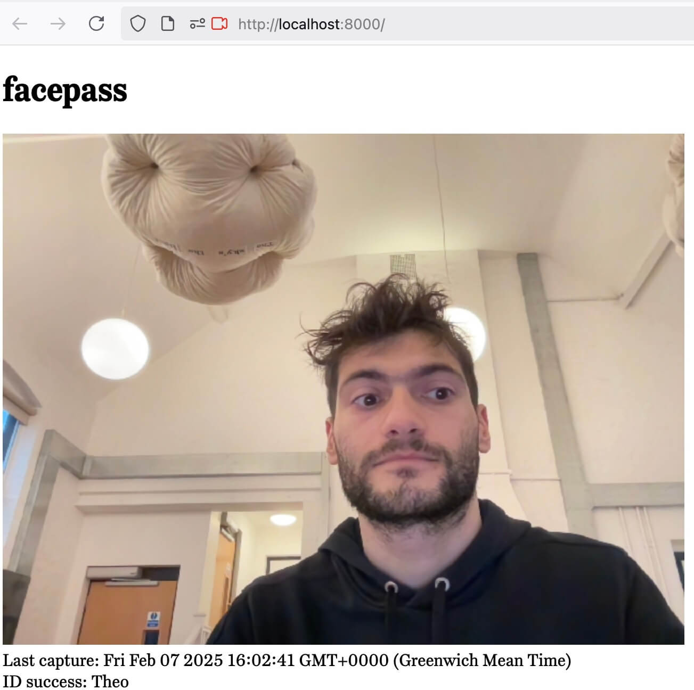

# facepass

Recognise your face among others.



## Prerequisites

* Python 3.10
* Computer with a webcam

## Set up

1. Set up Python 3.10 and dependencies.

```sh
python3.10 -m venv .venv
source .venv/bin/activate
pip install -r requirements.txt
```

2. Create a directory called `data` and add people face photos inside.

```sh
$ find data
data
data/dick.jpeg
data/harry.jpeg
data/jane.jpeg
data/jill.jpeg
data/mary.jpeg
data/tom.jpeg
```

3. Run in terminal:

```sh
python main.py
```

This should open a window that shows the webcam live feed and prints whether a person
has been recognised.

Quit with hitting 'q' on the keyboard.

4. Or run as a web app:

```sh
fastapi run server.py --host 127.0.0.1 --reload
```

## Dependencies

[pip-tools](https://github.com/jazzband/pip-tools) is used for depedency management.

To add a new dependency:

1. Install pip-tools:

  ```sh
  pip install pip-tools
  ```

2. Add new package on `requirements.in`:

  ```sh
  echo new-package >> requirements.in
  ```

3. Re-compile requirements:

  ```sh
  pip-compile requirements.in --no-strip-extras
  ```

4. Install new package:

  ```sh
  pip install -r requirements.txt
  ```
